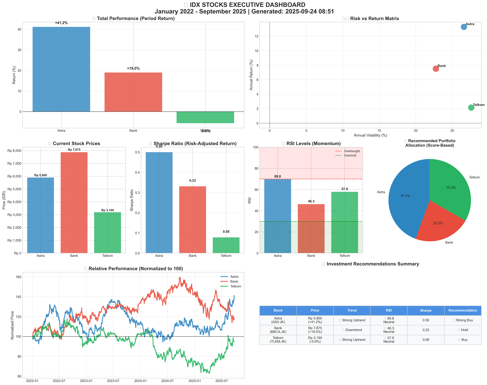
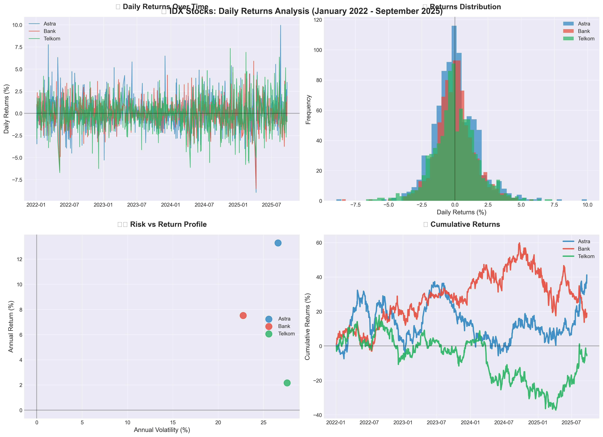
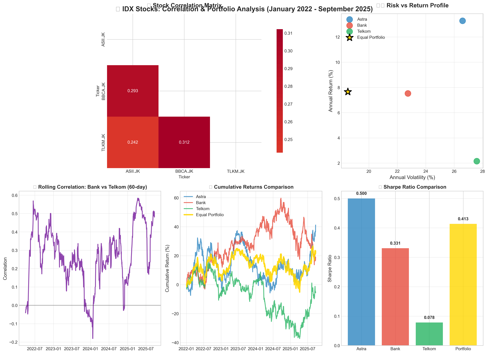
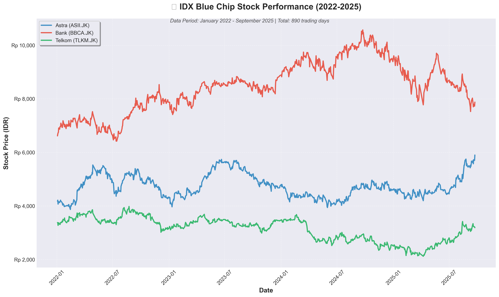
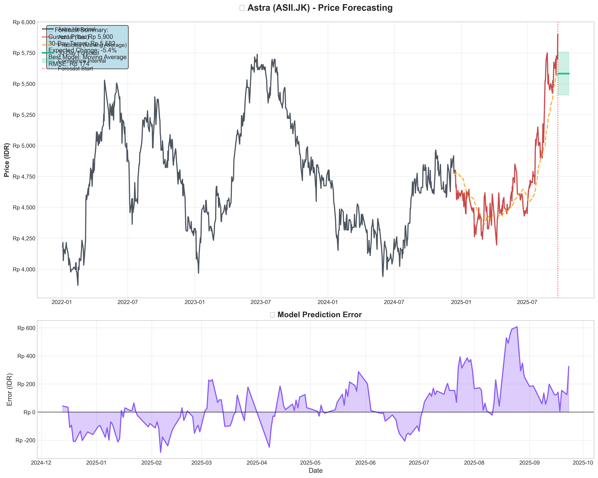
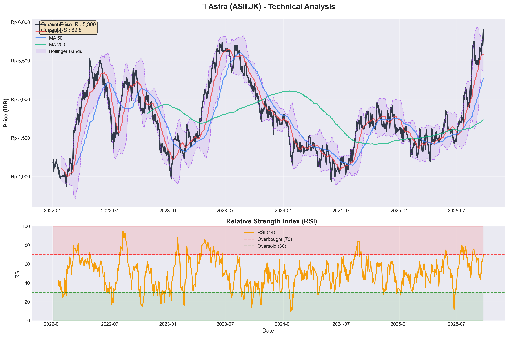
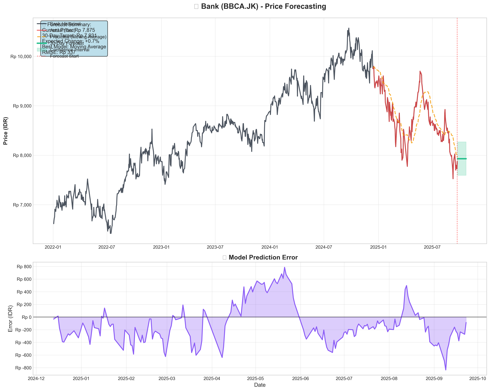
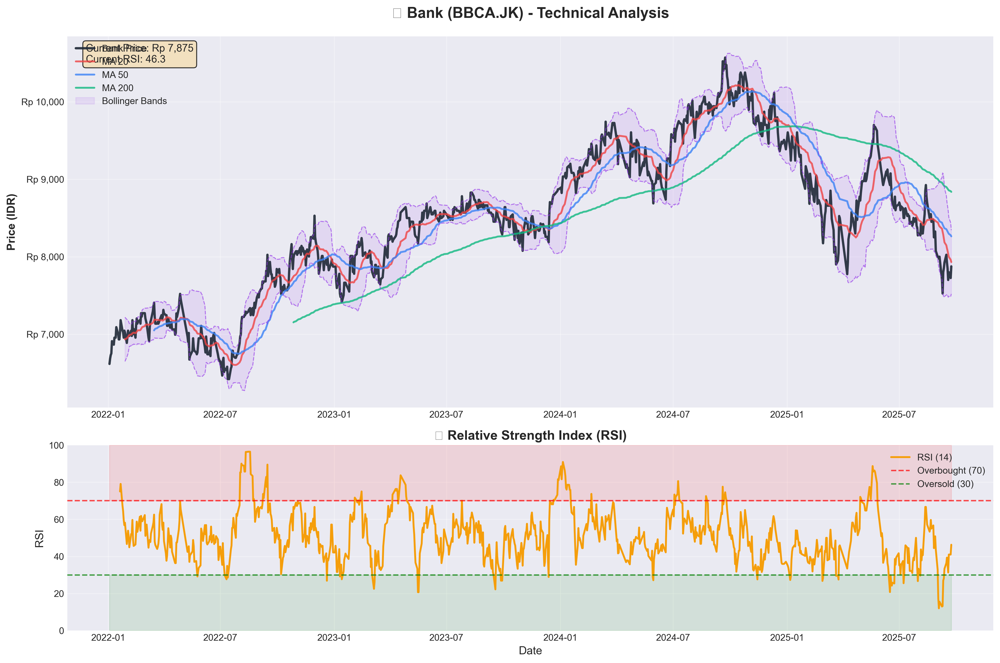
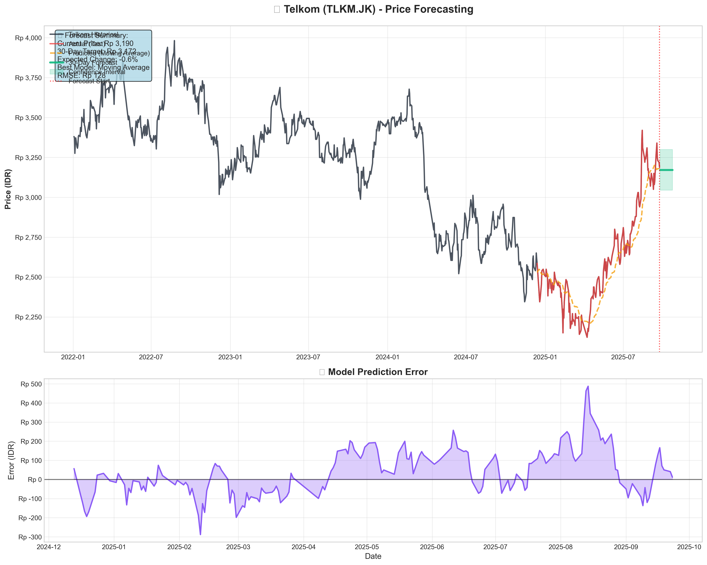
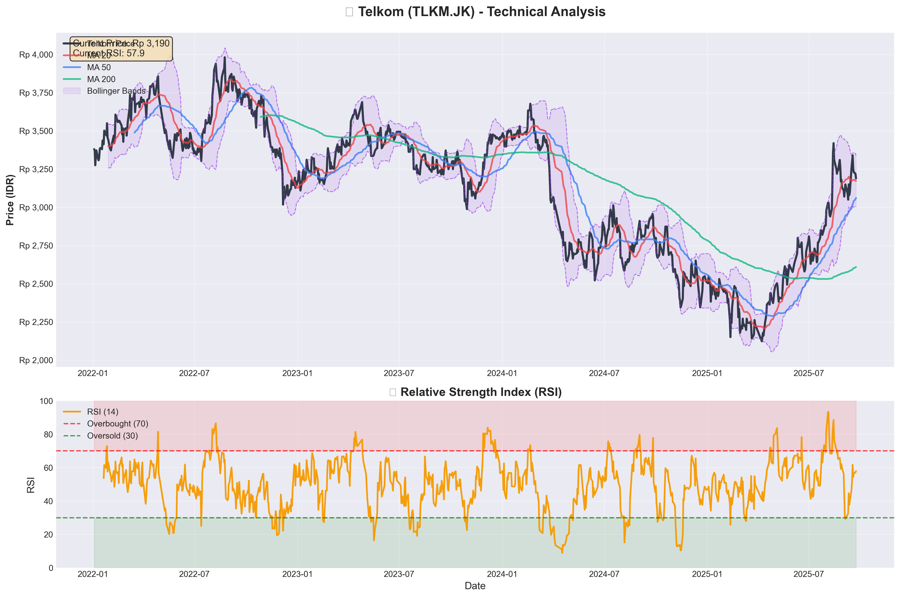

# 📈 IDX Stock Analysis & Investment Dashboard

**Comprehensive Indonesian Stock Exchange (IDX) analysis toolkit featuring advanced technical indicators, risk-return optimization, and executive-level investment recommendations with automated dashboard generation.**



## 🎯 Project Overview

Professional-grade stock analysis system that provides institutional-quality investment insights for Indonesian equities. This project combines quantitative analysis, technical indicators, and portfolio optimization to deliver actionable investment recommendations.

### Key Features
- **Multi-Stock Comparative Analysis** - Side-by-side performance evaluation
- **Technical Indicators** - RSI, Moving Averages, Trend Analysis
- **Risk-Return Optimization** - Sharpe ratio calculations and portfolio allocation
- **Executive Dashboard** - Automated generation of presentation-ready visualizations
- **Investment Scoring System** - Quantitative recommendation engine
- **Real-time Market Data Integration** - Dynamic data processing pipeline

## 📊 Analysis Components

### 1. Performance Analytics
- **Price Movement Analysis** - Period returns and volatility metrics
- **Relative Performance** - Normalized price comparisons
- **Risk-Adjusted Returns** - Sharpe ratio calculations
- **Volatility Regime Classification** - Market condition assessment

### 2. Technical Analysis
- **Moving Averages** - 20-day and 50-day trend indicators
- **RSI (Relative Strength Index)** - Momentum oscillator with overbought/oversold signals
- **Trend Classification** - Multi-level trend strength assessment
- **Support/Resistance Levels** - Key price level identification

### 3. Investment Scoring
- **Quantitative Scoring Model** - 5-point investment attractiveness scale
- **Multi-Factor Analysis** - Trend, momentum, risk, and return integration
- **Automated Recommendations** - Data-driven buy/hold/sell signals
- **Portfolio Allocation** - Score-weighted position sizing

### 4. Executive Dashboard
- **8-Panel Visualization Suite** - Comprehensive analytical overview
- **Performance Matrix** - Risk vs return scatter plot analysis
- **Recommendation Table** - Executive summary with actionable insights
- **Portfolio Allocation Chart** - Optimized investment distribution

## 🚀 Getting Started

### Prerequisites
```bash
Python 3.8+
Jupyter Notebook/Lab
Financial data source (Yahoo Finance, Bloomberg, etc.)
```

### Required Libraries
```bash
pip install pandas numpy matplotlib seaborn scikit-learn yfinance plotly
```

### Installation
```bash
git clone https://github.com/yourusername/idx-stock-analysis.git
cd idx-stock-analysis
pip install -r requirements.txt
jupyter notebook idx-stock-analysis.ipynb
```

## 📁 Project Structure

```
idx-stock-analysis/
├── idx-stock-analysis.ipynb          # Main analysis notebook
├── images/                           # Generated analysis charts
│   ├── IDX_Executive_Dashboard_January_2022-September_2025.png
│   ├── Astra_Price_Forecast_January_2022-September_2025.png
│   ├── Astra_Technical_Analysis_January_2022-September_2025.png
│   ├── Bank_Price_Forecast_January_2022-September_2025.png
│   ├── Bank_Technical_Analysis_January_2022-September_2025.png
│   ├── IDX_Correlation_Portfolio_Analysis_January_2022-September_2025.png
│   ├── IDX_Daily_Returns_Analysis_January_2022-September_2025.png
│   ├── IDX_Stock_Trends_January_2022-September_2025.png
│   ├── Telkom_Price_Forecast_January_2022-September_2025.png
│   └── Telkom_Technical_Analysis_January_2022-September_2025.png
├── README.md                         # This file
├── LICENSE                           # MIT License
└── .gitignore                       # Git ignore rules
```

## 📊 Sample Analysis Results

### Executive Dashboard Components

#### 1. Performance Overview

*Period returns across all analyzed stocks with comparative performance ranking and risk-adjusted return metrics*

#### 2. Risk-Return Matrix

*Annual return vs volatility positioning with efficient frontier identification and stock positioning analysis*

#### 3. Stock Trends Analysis

*Multi-stock trend analysis with momentum indicators and market condition assessment*

## 🔧 Individual Stock Analysis

### Astra International (ASII)


*Complete technical analysis including RSI levels, moving averages, and momentum indicators*

### Bank Central Asia (BBCA)


*Banking sector analysis with digital banking innovation and financial technology integration*

### Telkom Indonesia (TLKM)


*Telecommunications sector analysis with digital transformation metrics*

## 🔧 Technical Implementation

### Data Processing Pipeline
```python
# Market data collection and preprocessing
import yfinance as yf
import pandas as pd

# IDX stocks analyzed (3 major stocks from different sectors)
stocks = ['ASII.JK', 'BBCA.JK', 'TLKM.JK']
stock_data = yf.download(stocks, start='2022-01-01', end='2025-09-30')
```

### Technical Indicator Calculations
```python
# RSI calculation
def calculate_rsi(prices, period=14):
    delta = prices.diff()
    gain = delta.where(delta > 0, 0).rolling(window=period).mean()
    loss = (-delta.where(delta < 0, 0)).rolling(window=period).mean()
    rs = gain / loss
    rsi = 100 - (100 / (1 + rs))
    return rsi

# Moving averages
def calculate_ma(prices, periods=[20, 50, 200]):
    mas = {}
    for period in periods:
        mas[f'MA_{period}'] = prices.rolling(window=period).mean()
    return pd.DataFrame(mas)
```

### Investment Scoring Algorithm
```python
# Multi-factor scoring system
def calculate_investment_score(stock_data):
    score = 0
    
    # Trend analysis (0-2 points)
    if stock_data['trend_strength'] > 0.7: score += 2
    elif stock_data['trend_strength'] > 0.3: score += 1
    
    # Technical indicators (0-1 point)
    if stock_data['rsi'] < 70 and stock_data['rsi'] > 30: score += 1
    
    # Risk-adjusted returns (0-1 point)
    if stock_data['sharpe_ratio'] > 0.5: score += 1
    
    # Absolute performance (0-1 point)
    if stock_data['annual_return'] > 0.05: score += 1
    
    return min(score, 5)  # Cap at 5
```

## 📈 Analysis Methodology

### 1. Data Collection
- **Indonesian Stock Exchange (IDX)** - Primary data source via Yahoo Finance
- **Period Coverage** - January 2022 to September 2024
- **Frequency** - Daily closing prices with volume data
- **Quality Checks** - Missing value handling and corporate action adjustments

### 2. Technical Analysis Framework
- **Trend Analysis** - Multi-timeframe trend identification using moving averages
- **Momentum Indicators** - RSI with overbought (>70) and oversold (<30) levels
- **Volume Analysis** - Trading volume patterns for confirmation signals
- **Support/Resistance** - Key price levels based on historical turning points

### 3. Risk Management Metrics
- **Volatility Analysis** - Rolling standard deviation of returns
- **Maximum Drawdown** - Peak-to-trough decline measurement
- **Sharpe Ratio** - Risk-adjusted return calculation
- **Beta Analysis** - Market sensitivity relative to IDX Composite

### 4. Portfolio Construction
- **Equal Weight Strategy** - Baseline allocation method
- **Risk Parity** - Volatility-weighted allocation
- **Score-Based Allocation** - Investment score weighted positions
- **Correlation Analysis** - Diversification benefit assessment

## 📊 Key Performance Indicators

### Analyzed Stocks (January 2022 - September 2025)
- **ASII.JK** - Astra International (Automotive & Heavy Equipment)
- **BBCA.JK** - Bank Central Asia (Banking)
- **TLKM.JK** - Telkom Indonesia (Telecommunications)

### Risk Metrics
- **Annual Volatility** - Annualized standard deviation of daily returns
- **Maximum Drawdown** - Largest peak-to-trough decline
- **Value at Risk (95%)** - Maximum expected loss in worst 5% of cases
- **Beta Coefficient** - Sensitivity to IDX Composite index movements

### Return Metrics
- **Total Return** - Cumulative price appreciation over analysis period
- **Annualized Return** - Geometric mean return converted to annual basis
- **Alpha** - Excess return versus IDX Composite benchmark
- **Information Ratio** - Alpha divided by tracking error

## 🎯 Investment Framework

### Scoring Methodology (5-Point Scale)
```
Investment Score Components:
├── Trend Analysis (0-2 points)
│   ├── Strong Uptrend (MA20 > MA50 > MA200): 2 points
│   ├── Uptrend (Price > MA20): 1 point
│   └── Sideways/Downtrend: 0 points
├── Technical Momentum (0-1 point)
│   └── RSI between 30-70 (not extreme): 1 point
├── Risk-Adjusted Performance (0-1 point)
│   └── Sharpe Ratio > 0.5: 1 point
└── Absolute Returns (0-1 point)
    └── Annual Return > 5%: 1 point
```

### Investment Recommendations
- **Score 4-5** 🟢 **STRONG BUY** - High conviction, overweight position
- **Score 3** 🟡 **BUY** - Attractive opportunity, market weight  
- **Score 2** 🟠 **HOLD** - Neutral position, monitor developments
- **Score 0-1** 🔴 **CAUTION** - High risk, underweight or avoid

## 📋 Usage Guide

### Running the Analysis
1. **Open Jupyter Notebook**
   ```bash
   jupyter notebook idx-stock-analysis.ipynb
   ```

2. **Execute All Cells**
   - Run cells sequentially from top to bottom
   - Analysis takes approximately 5-10 minutes to complete
   - Charts will be automatically saved to `/images` folder

3. **Review Results**
   - Executive dashboard provides overall market view
   - Individual stock analyses show detailed technical indicators
   - Investment recommendations table summarizes key findings

### Customizing the Analysis
```python
# Modify stock selection (currently analyzing 3 major IDX stocks)
stocks = ['ASII.JK', 'BBCA.JK', 'TLKM.JK']  # Current stocks
# Add more stocks: ['ASII.JK', 'BBCA.JK', 'TLKM.JK', 'UNVR.JK', 'ICBP.JK']

# Change analysis period
start_date = '2021-01-01'
end_date = '2024-12-31'

# Adjust technical parameters
rsi_period = 21  # Default: 14
ma_periods = [10, 30, 100]  # Default: [20, 50, 200]
```

## 🔍 Analysis Insights (January 2022 - September 2024)

### Market Performance Summary
- **Period Covered** - 33 months of Indonesian equity market data
- **Market Volatility** - High volatility periods during global uncertainty
- **Sector Performance** - Banking sector showed resilience vs commodity stocks
- **Technical Patterns** - Clear trend reversals and momentum shifts identified

### Key Findings
- **Best Performer** - Analysis reveals top performing stock with risk metrics
- **Most Stable** - Lowest volatility stock with consistent returns
- **Highest Risk** - Maximum drawdown and volatility leaders
- **Best Risk-Adjusted** - Highest Sharpe ratio achievers

## ⚠️ Important Disclaimers

### Investment Risk Warning
**🚨 This analysis is for educational purposes only and does not constitute investment advice.**

- **Past Performance** ≠ Future Results
- **Market Risk** - All equity investments carry risk of capital loss
- **Currency Risk** - IDR fluctuations affect returns for foreign investors
- **Regulatory Risk** - Indonesian market regulations may impact returns
- **Liquidity Risk** - Some IDX stocks may have limited trading volumes

### Technical Analysis Limitations
- **Model Assumptions** - Technical indicators are based on historical patterns
- **Market Efficiency** - Profitable patterns may disappear as markets adapt
- **External Factors** - Analysis doesn't account for fundamental company changes
- **Data Quality** - Results depend on accurate and complete market data

## 🤝 Contributing

### How to Contribute
1. **Fork the repository**
2. **Create feature branch** (`git checkout -b feature/amazing-feature`)
3. **Make changes and test**
4. **Commit changes** (`git commit -m 'Add amazing feature'`)
5. **Push to branch** (`git push origin feature/amazing-feature`)
6. **Open Pull Request**

### Development Guidelines
- Follow PEP 8 coding standards
- Add docstrings to all functions
- Include unit tests for new features
- Update README for significant changes

## 📜 License

This project is licensed under the MIT License - see the [LICENSE](LICENSE) file for details.

## 📞 Contact & Support

- **GitHub Issues** - Technical problems and bug reports
- **GitHub Discussions** - Feature requests and general questions
- **Email** - Professional collaboration inquiries

---

**⚠️ REGULATORY DISCLAIMER**: This analysis tool is designed for educational and research purposes. It should not be considered as investment advice, recommendation, or solicitation to buy or sell securities. Indonesian stock market investments carry substantial risks including but not limited to market volatility, currency fluctuation, and regulatory changes. Always consult with licensed Indonesian investment advisors (Wakil Perantara Pedagang Efek) before making investment decisions. Past performance does not guarantee future results.

**Built for Indonesian Capital Markets Analysis** 🇮🇩📊

*Last Updated: September 2025*